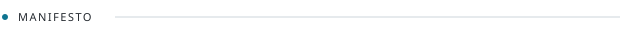
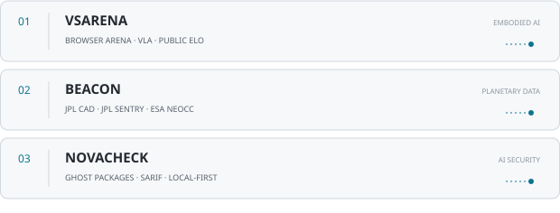
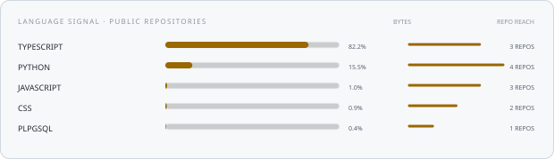
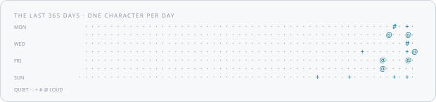
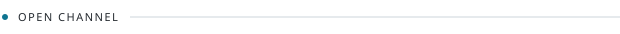

<div align="center">



[github](https://github.com/arankair) &nbsp;·&nbsp;
[vsarena](https://vsarena.vercel.app) &nbsp;·&nbsp;
[email](mailto:arankair.dev@gmail.com)

</div>

<br>



> Independent technologist. Software, AI and robotics systems — built in public.

I am **Aran Kair**. I design tools and environments where models have to act in
the world, not only talk about it. **XYDEN** is my lab and GitHub organization:
software, embodied AI and open systems that can be inspected, scored and reused.

The rule is simple: **if it cannot be watched, it does not count.**

<br>


```console
$ python -m vsarena
HOLDPOSE  dry-run · VLA track · harness ready
```

Right now I am shipping **[VSArena](https://github.com/arankair/VSArena)** —
an open browser arena for embodied / VLA stacking. Watch the physics, run a
policy, read a public board the browser cannot write.

<br>



**[VSArena](https://github.com/arankair/VSArena)** &nbsp;·&nbsp;
<samp>next.js / python / rapier</samp><br>
One stacking task on purpose. Rapier at 60 Hz in the browser, a VLA observation
track, a Python SDK and harness ELO. **[Open the live arena →](https://vsarena.vercel.app)**

**[Beacon](https://github.com/arankair/B.E.A.C.O.N)** &nbsp;·&nbsp;
<samp>next.js / typescript / open data</samp><br>
Places JPL CAD, JPL Sentry and ESA NEOCC values side by side for the same
near-Earth object. No average, no proprietary risk score.
**[Open the live system →](https://novabeacon.vercel.app)**

**[NovaCheck](https://github.com/arankair/NovaCheck)** &nbsp;·&nbsp;
<samp>typescript / node / sarif</samp><br>
Local-first CLI that finds hallucinated npm and PyPI packages in manifests,
imports, docs and agent files—before you install them. Source stays on the
machine.

<br>

<samp>
WORKING SET / TYPESCRIPT · PYTHON · NEXT.JS · REACT · NODE · RAPIER · BUN · GIT · LINUX
</samp>

<br><br>


<div align="center">







</div>

<br>



If you work on **embodied AI**, **evaluation in the open**, or **robotics
software**, I am interested in sharp protocols, reproducible failures and small
collaborations.

**[github.com/arankair](https://github.com/arankair)** &nbsp;·&nbsp;
**[arankair.dev@gmail.com](mailto:arankair.dev@gmail.com)**

<br>

<sub>
Every graphic on this page is generated inside this repository. Public GitHub
signals are drawn directly from the GraphQL API by a scheduled workflow. Fonts
are subset and embedded. No tracking pixels, external stat cards or runtime
data services.
</sub>
